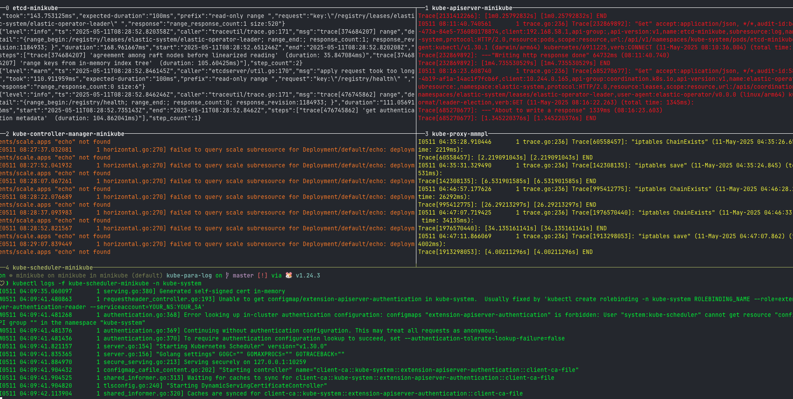

# kube-para-log

A lightweight CLI tool that shows `kubectl logs` from multiple Kubernetes pods **in parallel** using `tmux`. Ideal for real-time log monitoring during deployments or operational transitions.


## Features

- Filters pods by name keyword
- Splits your terminal window using `tmux` (one pane per pod)
- Supports custom namespaces
- Supports `--tail` and `--since` log options
- Automatically colorizes pane borders for readability
- Pane titles are set to pod names

## Requirements

- [tmux](https://github.com/tmux/tmux) (v2.1+ recommended)
- [kubectl](https://kubernetes.io/docs/tasks/tools/)
- Access to a Kubernetes cluster (e.g., Minikube, EKS)

## Installation

Download the latest binary from the [Releases page](https://github.com/yourname/kube-para-log/releases) and move it to your `$PATH`.

```sh
chmod +x kube-para-log
sudo mv kube-para-log /usr/local/bin/
```

You can build from source using Go 1.18+ if needed.

```sh
go build -o kube-para-log .
```

## Usage

```sh
kube-para-log <pod-name-keyword> [flags]

Example:

kube-para-log nginx --namespace=production --tail=100 --since=10m

This command will:
	•	Find all pods in production namespace with nginx in their name
	•	Open a tmux session with one pane per pod
	•	Stream the last 100 lines of logs from the past 10 minutes
```

### Flags

```
Flag	Description	Default
--namespace, -n	Target Kubernetes namespace	default
--tail	Number of recent log lines to display	0 (all)
--since	Only return logs newer than a relative duration (e.g. 5s, 2m, 1h)	none
```

## Screenshot



## Tips
-	Run from outside tmux for a new session to be created.
-	Run inside tmux to use your current session and split the current window.
-	Use tmux config to enhance pane title visibility:
```conf
set-option -g pane-border-status top
set-option -g pane-border-format "#{pane_index} #[bold]#{pane_title}"
```

## License
MIT
